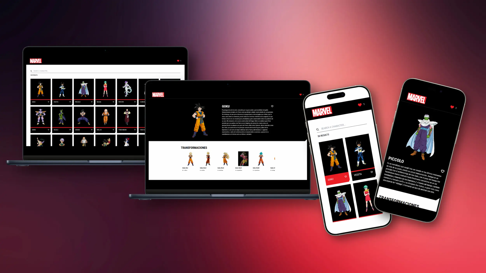

# Marvel App

Este proyecto es una aplicación web responsive desarrollada con React, TypeScript y Redux Toolkit. Inicialmente fue planeado para utilizar la API oficial de Marvel, pero debido a problemas técnicos con la API original (problemas de disponibilidad y rendimiento), finalmente se implementó utilizando la alternativa proporcionada: la **Dragon Ball API**.

## Vistas Principales

### 1. Vista Principal

- Listado inicial con los primeros 50 personajes de Dragon Ball.
- Barra de búsqueda para filtrar personajes por nombre en tiempo real.
- Contador dinámico de resultados encontrados.
- Opción para marcar y almacenar personajes favoritos, persistiendo en almacenamiento local.
- Botón superior para filtrar y mostrar únicamente personajes favoritos.

### 2. Vista Detalle del Personaje

- Información detallada del personaje seleccionado: imagen, nombre y descripción.
- Listado de transformaciones del personaje ordenadas según el KI.
- Opción para añadir o remover al personaje como favorito.
- Iconos de navegación para volver al listado general o al listado de favoritos.

## Cómo ejecutar el proyecto

```bash
# Clona el repositorio
git clone https://github.com/JorgeLuisParedes/marvel-app.git

# Instala las dependencias
npm install

# Inicia el servidor en modo desarrollo
npm run dev

# Construye para producción
npm run build

# Ejecuta verificación de código antes del commit (lint, formato y tipos)
npm run precommit

# Ejecuta las pruebas (unitarias, integración y hooks)
npm run test

# Ejecuta las pruebas (unitarias, integración y hooks) en modo watch
npm run test:watch
```

## Vista previa del proyecto

A continuación se muestran capturas representativas de la aplicación en funcionamiento, tanto en su versión de escritorio como en dispositivos móviles. Estas imágenes reflejan la estructura, el diseño y la interacción general del usuario dentro del sistema.



## Navegación y Rutas

La aplicación está estructurada como una Single Page Application (SPA) y utiliza React Router DOM para la navegación. Las rutas disponibles son:

- `/` → Página principal con el listado de personajes.
- `/character/:id` → Vista detallada del personaje seleccionado.
- `/favorites` → Filtro activado para mostrar solo los personajes marcados como favoritos (implementado desde la página principal, no como ruta explícita).

Todas las rutas están protegidas con un manejo adecuado de errores y navegación segura en caso de rutas no válidas.

## Ejemplos de Pruebas

La aplicación cuenta con una estrategia de testing basada en **Jest** y **React Testing Library**, cubriendo pruebas unitarias, de integración y hooks personalizados.

A continuación se muestran ejemplos destacados que representan esta implementación:

### Prueba unitaria

Verifica que el reducer de favoritos maneje correctamente la acción de agregar:

```ts
it('debería agregar un personaje favorito', () => {
	const state = favoritesReducer(undefined, addFavorite(mockCharacter));
	expect(state.favorites).toContainEqual(mockCharacter);
});
```

### Prueba de integración

Asegura que el componente interactúe correctamente con Redux ante una acción del usuario:

```tsx
it('dispara toggleFavorite al hacer clic en el botón', async () => {
	const store = createTestStore({
		favorites: { favorites: [] },
	});

	const spy = jest.spyOn(store, 'dispatch');

	renderWithStore(<Character {...mockCharacter} />, {
		store,
		withRouter: true,
	});

	const button = screen.getByRole('button');
	await userEvent.click(button);

	expect(spy).toHaveBeenCalledWith(toggleFavorite(mockCharacter));
});
```

### Prueba de hook personalizado

Comprueba que el hook filtre correctamente los personajes según el término de búsqueda:

```tsx
it('filtra los personajes por nombre', () => {
	const { result } = renderUseCharactersList({ searchTerm: 'gok' });
	expect(result.current.filteredCharacters).toHaveLength(1);
	expect(result.current.filteredCharacters[0].name).toBe('Goku');
});
```

## Stack Tecnológico

Tecnologías y herramientas empleadas en el desarrollo del proyecto:

- **Node.js >= 18** — Entorno de ejecución requerido para scripts y dependencias modernas.
- **Vite 6.2** — Herramienta moderna de desarrollo y bundling con tiempos de recarga ultrarrápidos.
- **React 19** — Librería principal para construir interfaces de usuario.
- **TypeScript 5.7** — Añade tipado estático, mejora la mantenibilidad y reduce errores.
- **React Router DOM 6.30** — Manejo de rutas en la SPA con navegación declarativa.
- **Redux Toolkit** — Utilizado para:
    - La configuración y estructura del store global.
    - La gestión del estado local/global.
    - La conexión con la API mediante RTK Query.
    - redux-persist — Permite persistir datos clave (como favoritos) en el almacenamiento local.
- **Tailwind CSS 4** — Sistema de utilidades para construir estilos desde cero sin dependencias externas.
- **Jest + React Testing Library** — Framework de pruebas unitarias y de integración.
- **ESLint + Prettier** — Herramientas para análisis estático de código y formato automático.

## Decisiones Tecnológicas

Elecciones técnicas clave realizadas durante el desarrollo:

**React Router DOM**  
Se utilizó por su compatibilidad con SPAs modernas y su simplicidad en comparación con otras soluciones como Reach Router.

**Redux Toolkit + redux-persist**  
Permite una gestión eficiente del estado global y la persistencia local sin configuración compleja.  
Elegido frente a MobX por su mayor adopción, robustez y soporte a patrones SOLID.  
También se prefirió sobre TanStack Query ya que la lógica de negocio requiere más control sobre el estado que sobre el fetching.

**Tailwind CSS**  
Escogido para cumplir con el criterio de crear componentes desde cero, evitando el uso de bibliotecas externas como Material UI o Ant Design. Facilita una implementación rápida de estilos consistentes.

**Vite**  
Elegido sobre Webpack por su rendimiento superior en tiempos de arranque y recarga, configuración mínima y compatibilidad moderna con TypeScript + JSX.

## Estructura del proyecto

```plaintext
src/
├── __tests__/             # Pruebas unitarias, de integración y hooks
├── api/                   # Configuración y conexión con APIs externas
│   └── marvelApi.ts
├── components/            # Componentes visuales organizados por feature
│   ├── character-details/     # Vista detallada de personajes
│   ├── character-list/        # Listado y filtrado de personajes
│   └── ui/                    # Elementos de interfaz genéricos (iconos, header, mensajes, barra de progreso)
├── hooks/                 # Hooks personalizados reutilizables
├── pages/                 # Vistas principales de la aplicación (Home, Detalle)
├── router/                # Configuración de rutas y enrutamiento principal
├── store/                 # Slices de Redux Toolkit y configuración del store global
├── types/                 # Definiciones de tipos globales para TypeScript
├── MarvelApp.tsx          # Componente raíz de la aplicación
├── main.tsx               # Punto de entrada de la app
└── styles.css             # Estilos globales base
```

## Despliegue en Producción

Este proyecto está desplegado en Vercel:  
[https://marvel-app-six-delta.vercel.app](https://marvel-app-six-delta.vercel.app)

### Configuración destacada

- Se incluyó un archivo `vercel.json` para garantizar el correcto manejo de rutas en producción como SPA.
- Se definió el siguiente comando de build personalizado para evitar conflictos de dependencias durante la instalación:

```plaintext
"buildCommand": "npm install --legacy-peer-deps && npm run build"
```

## Manejo de Errores

La aplicación implementa un manejo de errores controlado para mejorar la experiencia del usuario y garantizar la estabilidad de la interfaz:

- **Errores de red/API:**  
  Si la API no responde o retorna un error, se muestra un mensaje informativo al usuario mediante el componente `Message`.

- **Estados vacíos:**  
  En caso de que no se encuentren resultados al filtrar personajes, se muestra retroalimentación visual adecuada.

- **Rutas inválidas (SPA):**  
  La configuración de Vercel y React Router aseguran que cualquier ruta no reconocida sea redirigida correctamente al componente principal, evitando errores 404 inesperados.

- **Acciones repetidas o inválidas:**  
  El estado de favoritos evita duplicados y permite alternar correctamente entre agregar y quitar personajes del almacenamiento local.

## Posibles mejoras

A continuación se describen algunas mejoras que podrían implementarse en versiones futuras del proyecto:

- **Fallback entre APIs (Marvel y Dragon Ball):**  
  Implementar un sistema de contingencia que intente primero consumir la API oficial de Marvel.  
  En caso de error (timeout, status >= 400), la aplicación debería cambiar automáticamente a la API de Dragon Ball.  
  Esto incluiría adaptar visualmente algunos componentes (estilos, textos, imágenes) según la fuente de datos activa, reutilizando la lógica existente (hooks, estados y estructuras) en la medida de lo posible.

- **Paginación o carga progresiva:**  
  Implementar paginación o scroll infinito para evitar cargar los 50 personajes de golpe y mejorar el rendimiento general.

- **Internacionalización (i18n):**  
  Incorporar soporte multilenguaje utilizando librerías como `react-i18next`, permitiendo alternar entre idiomas (por ejemplo, inglés y español) desde una opción en la interfaz.  
  Esto mejoraría la accesibilidad global del proyecto y lo haría escalable para usuarios internacionales.

- **Mejoras en accesibilidad (a11y):**  
  Incorporar más atributos semánticos (`aria-*`, roles, foco visual) para navegación con teclado y lectores de pantalla.

- **Modo oscuro:**  
  Añadir soporte para modo oscuro con persistencia en `localStorage` y adaptación automática al sistema operativo.

## Conclusión

Este proyecto demuestra una implementación sólida de una SPA moderna utilizando React, TypeScript y Redux Toolkit.  
Se abordaron los requerimientos principales de forma estructurada, aplicando principios de escalabilidad, reutilización de componentes y pruebas automatizadas.

A pesar de los problemas con la API original de Marvel, se logró adaptar la solución utilizando una alternativa sin comprometer la experiencia del usuario.  
Además, se identificaron posibles mejoras futuras que permitirían escalar el proyecto y enriquecer su funcionalidad en un entorno real de producción.

El enfoque modular, la cobertura de pruebas, el despliegue funcional y el manejo de errores aseguran que la aplicación no solo funcione correctamente, sino que sea mantenible y adaptable a largo plazo.
